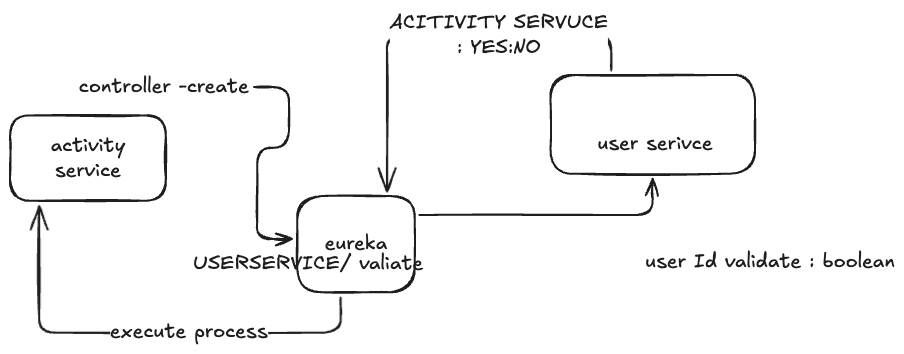

# PayPal - Payment System

## User-Service : 8082
-  Spring web -> RESTfull API client and server request and response
-  Spring JPA -> java object/entity relational mapping with database
-  h2 database -> in memory database

-  Spring Security -> authentication and authorization



### API Restfull Documations

### Auth : api/v1/auth
1. Post : /signup
2. Post : /login

### User : api/v1/user
1. Get : /{id}
2. Get : /all
3. Post : /create ---> internally Sync way create walletClient 
---

## API-Gateway


---
## Payment Service


---
## Notification Service


---
## Wallet Service


---
## Reward Service

---
# Docker ==Compose. -- 
-  kafka 
   docker-compose up -d
-  zookeeper

```
➜  paypal-clone git:(paypal) ✗ docker ps            
CONTAINER ID   IMAGE                             COMMAND                  CREATED          STATUS          PORTS                                        NAMES
31aba80914a5   confluentinc/cp-kafka:7.4.1       "/etc/confluent/dock…"   20 seconds ago   Up 18 seconds   0.0.0.0:9092->9092/tcp                       paypal-clone-kafka-1
c8cc6bd700a7   confluentinc/cp-zookeeper:7.4.1   "/etc/confluent/dock…"   20 seconds ago   Up 19 seconds   2888/tcp, 0.0.0.0:2181->2181/tcp, 3888/tcp   paypal-clone-zookeeper-1

```


## NOTE:
the PayPal project is intentionally set up to use its own Kafka instance (kafka-paypal) to keep its data and configuration isolated from the Netflix project.