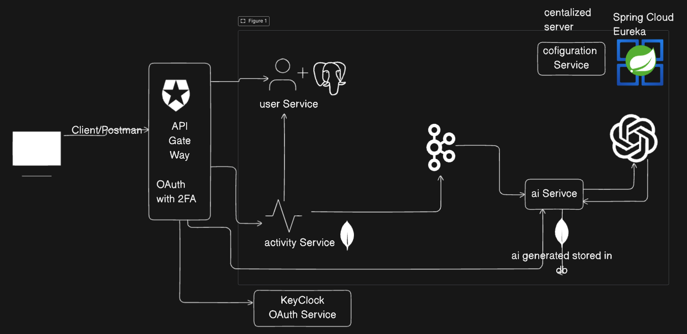
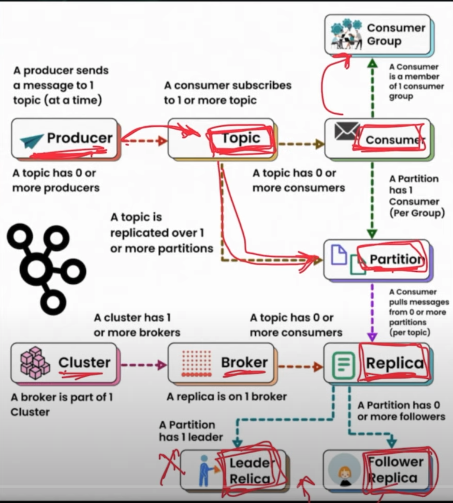
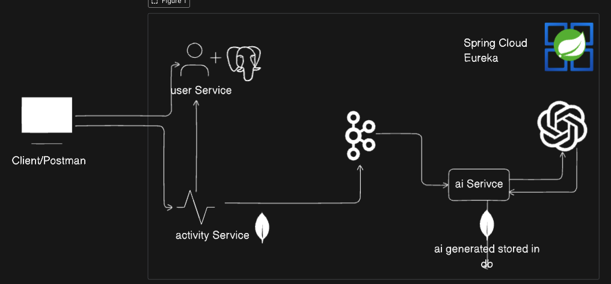
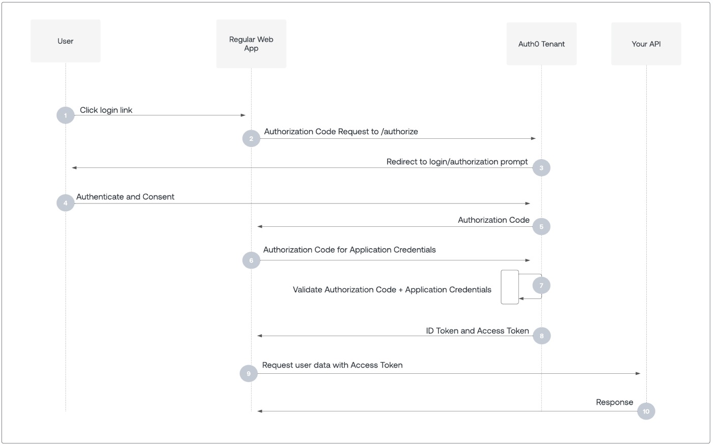

# AI-Fitness-Planner : Java Microservices Application
## HLD Diagram :construction:

## userService
PORT : 8081
- Register user
POST : http://localhost:8081/api/users/register
```
{
    "firstName": "Vikas",
    "lastName": "Arya",
    "email": "vikasarya@gmail.com",
    "password": "123456"
}
```
Response :-
```
{
    "id": "1",
    "firstName": "Vikas",
    "lastName": "Arya",
    "email": "vikasarya@gmail.com",
    "password": "123456",
    "createdAt": "2023-05-01T12:00:00",
    "updatedAt": "2023-05-01T12:00:00"
}
```

- Get user profile
GET : http://localhost:8080/api/users/1
Response:-
```
{
    "id": "1",
    "firstName": "Vikas",
    "lastName": "Arya",
    "email": "vikasarya@gmail.com",
    "password": null,
    "createdAt": "2023-05-01T12:00:00",
    "updatedAt": "2023-05-01T12:00:00"
}
```

- Get all users
GET : http://localhost:8080/api/users/allUser
Response:-
```
[
    {
        "id": "1",
        "firstName": "Vikas",
        "lastName": "Arya",
        "email": "vikasarya@gmail.com",
        "password": null,
        "createdAt": "2023-05-01T12:00:00",
        "updatedAt": "2023-05-01T12:00:00"
    }
]
```


## activityService
- Track activity
POST : http://localhost:8082/api/activities
```
{
    "userId": "123456",
    "activityType": "RUNNING",
    "caloriesBurned": 250,
    "duration": 30,
    "startTime": "2025-09-17T07:30:00",
    "additionalMatrics": {
        "distance": 5.2,
        "steps": 7000
    }
}
```
Response:-
```
{
    "id": "1",
    "userId": "123456",
    "activityType": "RUNNING",
    "caloriesBurned": 250,
    "duration": 30,
    "startTime": "2025-09-17T07:30:00",
    "additionalMatrics": {
        "distance": 5.2,
        "steps": 7000
    },
    "createdAt": "2023-05-01T12:00:00",
    "updatedAt": "2023-05-01T12:00:00"
}
```

## Spring Eureka Cloud
```
eureka:
  client:
    service-url:
      defaultZone: http://localhost:8761/eureka/
```

```
eureka:
  client:
    register-with-eureka: false
    fetch-registry: false
```

## Inter-service communication :EUREKA:


## ai Service
PORT : 8083
- Get user all recommendations
GET : http://localhost:8083/api/recommendations/user/123456

response
```
[
    {
        "id": "1",
        "activityId": "1",
        "userId": "123456",
        "recommendation": "Run for 30 minutes",
        "improvements": [
            "Increase calories burned",
            "Increase duration"
        ],
        "suggestions": [
            "Increase calories burned",
            "Increase duration"
        ],
        "safety": [
            "Increase calories burned",
            "Increase duration"
        ],
        "createdAt": "2023-05-01T12:00:00",
        "updatedAt": "2023-05-01T12:00:00"
    }
]
```

- Get activity recommendations
GET : http://localhost:8083/api/recommendations/activity/1

Response:-
```{
    "id": "1",
    "activityId": "1",
    "userId": "123456",
    "recommendation": "Run for 30 minutes",
    "improvements": [
        "Increase calories burned",
        "Increase duration"
    ],
    "suggestions": [
        "Increase calories burned",
        "Increase duration"
    ],
    "safety": [
        "Increase calories burned",
        "Increase duration"
    ],
    "createdAt": "2023-05-01T12:00:00",
    "updatedAt": "2023-05-01T12:00:00"
} 
```

## Kafka on Docker
PORT : 9092

#### Docker commands
```
docker run -d -p 9092:9092 apache/kafka:latest

```
```
kafka:
    bootstrap-servers: localhost:9092
    consumer:
      group-id: activity-processing-group
      key-deserializer: org.apache.kafka.common.serialization.StringDeserializer
      value-deserializer: org.springframework.kafka.support.serializer.JsonDeserializer
    properties:
      spring.json.trusted.packages: "*"
      spring.json.value.type.headers: false
      spring.json.value.default.type: package com.AiFitness.aiService.model.Activity

```

```
kafka:
    bootstrap-servers: localhost:9092
    producer:
      key-serializer: org.apache.kafka.common.serialization.StringSerializer
      value-serializer: org.springframework.kafka.support.serializer.JsonSerializer

```




---
## GEMINI API
POST
https://generativelanguage.googleapis.com/v1beta/models/gemini-2.0-flash:generateContent
```
headers
Content-Type: application/json
x-goog-api-key: YOUR_API_KEY

{
  "contents": [
    {
      "parts": [
        {
          "text": "Run for 30 minutes"
        }
      ]
    }
  ]
}
```
response
```{
    "candidates": [
        {
            "content": {
                "parts": [
                    {
                        "text": "AI learns from data to make predictions or decisions.\n" 
                    }
                ],
                "role": "model"
            },
            "finishReason": "STOP",
            "avgLogprobs": -0.067390631545673721
        }
    ],
 ------..................
}
```



## Configuration Service

PORT : 8888 
- with native - Config at classpath

## API Gateway
PORT : 8080
- configure at config server

---
## OAuth2 Service(Open Autherization)
 -WHAT: OAuth lets apps access your info without needing  your password
 - WHY : Its safer because we dont need to store passwords or share them with 3rd party apps
 - Problem Solved : We can use OAuth to authenticate users and authorize them to access certain resources
 - How it works : you login through a trusted service (Google, Facebook, Twitter, etc) and give permission, and the app gets a special token to access your infor without needing your password
 
 - Resource Owner: The user who owns the resource
 - Resource Server: The server that hosts the resource
 - Authorization Server: The server that issues access tokens to the client
 - third party app: The app that wants to access the resource
 - client: The app that wants to access the resource

REFERENCES:~~~https://auth0.com/docs/get-started/authentication-and-authorization-flow~~~
 


 #### PCKE : Proof Key for Code Exchange : for Frontend follow
 REFERENCES:

 #### Client Credentials Flow :SERVER to SERVER


 ### KeyCloak : Open Sourece Identity and Access Management
